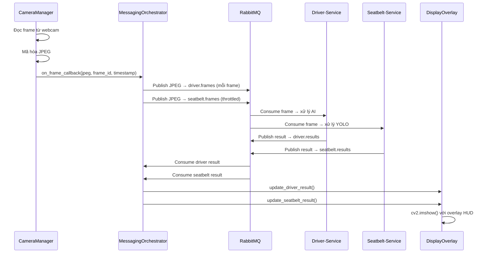

# README - Camera-Service

## Giới thiệu

Camera-Service là dịch vụ đầu vào của hệ thống ADAS đa phương thức (multimodal-ADAS). Dịch vụ này chịu trách nhiệm thu nhận hình ảnh từ webcam, phân phối khung hình đến các dịch vụ AI thông qua RabbitMQ, nhận kết quả suy luận và hiển thị lên màn hình giám sát.

Phiên bản hiện tại sử dụng kiến trúc giao tiếp bất đồng bộ qua RabbitMQ thay vì HTTP đồng bộ, giúp Camera-Service hoạt động độc lập hoàn toàn với tốc độ xử lý của các dịch vụ AI.

## Mục đích Service

| Mục đích | Mô tả |
|----------|-------|
| Thu nhận hình ảnh | Đọc luồng video từ webcam với tốc độ tối đa phần cứng hỗ trợ |
| Phân phối khung hình | Gửi khung hình JPEG đến Driver-Service và Seatbelt-Service qua RabbitMQ |
| Nhận kết quả AI | Tiêu thụ kết quả suy luận từ cả hai dịch vụ AI |
| Hiển thị giám sát | Hiển thị luồng camera kèm overlay trạng thái AI qua OpenCV |
| Cung cấp API | Expose REST API cho health check, frame retrieval, và thống kê |

## Chức năng

1. **Khởi động/Dừng camera** - Mở và đóng webcam an toàn
2. **Thu nhận khung hình liên tục** - Vòng lặp nền đọc frame, mã hóa JPEG
3. **Phát hành khung hình Driver** - Gửi MỌI khung hình đến queue `driver.frames`
4. **Phát hành khung hình Seatbelt** - Gửi 1 khung hình mỗi `SEATBELT_FRAME_INTERVAL` giây (mặc định 600s) đến queue `seatbelt.frames`
5. **Tiêu thụ kết quả Driver** - Lắng nghe queue `driver.results`
6. **Tiêu thụ kết quả Seatbelt** - Lắng nghe queue `seatbelt.results`
7. **Hiển thị OpenCV** - Cửa sổ `cv2.imshow` với overlay HUD
8. **API REST** - `/health`, `/frame`, `/info`, `/stats`

## Kiến trúc

```
Camera-Service
├── FastAPI Main Thread       (HTTP request/response)
├── Camera Capture Thread     (đọc webcam, mã hóa JPEG)
├── Driver Publisher          (gửi frame mỗi frame)
├── Seatbelt Publisher        (gửi frame theo interval)
├── Result Consumer Thread    (nhận kết quả AI)
└── Display Thread            (cv2.imshow + overlay)
```

## Luồng hoạt động



## Công nghệ sử dụng

| Công nghệ | Phiên bản | Mục đích |
|-----------|-----------|----------|
| Python | 3.11 | Ngôn ngữ chính |
| FastAPI | 0.111.0 | REST API framework |
| Uvicorn | 0.30.1 | ASGI server |
| OpenCV | 4.13.0.92 | Thu nhận webcam, mã hóa JPEG, hiển thị |
| Pika | 1.3.2 | RabbitMQ client |
| Pydantic | 2.7.1 | Data validation |
| NumPy | 2.4.6 | Xử lý mảng ảnh |
| Docker | - | Container hóa |

## Cấu trúc thư mục

```
camera-service/
├── Dockerfile
├── main.py                          # Entry point: uvicorn runner
├── requirements.txt                 # Python dependencies
├── desktop_monitor.py               # [DEPRECATED] Desktop dashboard cũ
│
├── app/
│   ├── __init__.py
│   ├── main.py                      # FastAPI app + lifespan
│   ├── api/
│   │   ├── __init__.py
│   │   └── camera.py                # Routes: /health, /frame, /info, /stats
│   ├── core/
│   │   ├── __init__.py
│   │   └── config.py                # Settings (camera + RabbitMQ)
│   ├── messaging/
│   │   ├── __init__.py
│   │   ├── connection.py            # RabbitMQConnectionManager
│   │   ├── publisher.py             # FramePublisher
│   │   ├── consumer.py              # ResultConsumer
│   │   └── orchestrator.py          # MessagingOrchestrator
│   ├── models/
│   │   ├── __init__.py
│   │   └── messages.py              # FrameMessage, DriverResultMessage, SeatbeltResultMessage
│   ├── services/
│   │   ├── __init__.py
│   │   ├── camera_manager.py        # CameraManager
│   │   ├── camera_manager_instance.py
│   │   └── display.py               # DisplayOverlay
│   ├── schemas/
│   │   ├── __init__.py
│   │   └── camera.py                # API schemas
│   └── utils/
│       ├── __init__.py
│       └── logger.py                # Structured logger
│
├── documents/                       # Tài liệu chính thức
├── memory/                          # Bộ nhớ dự án (cho AI Agent)
├── knowledge-base/                  # Kiến thức ổn định (cho AI Agent)
└── tests/                           # Unit + Integration tests
```

## Runtime Flow

```
1. FastAPI lifespan START
2. CameraManager.start() → mở webcam, chạy capture thread
3. MessagingOrchestrator.start()
   a. RabbitMQConnectionManager.connect() → kết nối với retry
   b. FramePublisher("driver.frame").start() → tạo channel, khai báo exchange
   c. FramePublisher("seatbelt.frame").start() → tạo channel, khai báo exchange
   d. CameraManager.set_on_frame_callback(handler) → wire callback
   e. ResultConsumer.start() → thread riêng lắng nghe kết quả
   f. DisplayOverlay.start() → thread hiển thị OpenCV
4. Hệ thống chạy liên tục
5. FastAPI lifespan SHUTDOWN
6. MessagingOrchestrator.stop() → dừng display, consumer, publishers, connection
7. CameraManager.stop() → đóng webcam
```

## Memory

Thư mục `memory/` lưu trữ ký ức dài hạn của dự án. Các AI Agent trong tương lai sẽ đọc và cập nhật các tệp này trong quá trình phát triển.

- **decisions.md** - Các quyết định thiết kế quan trọng
- **changelog.md** - Lịch sử thay đổi
- **implementation_notes.md** - Ghi chú dành cho developer
- **known_issues.md** - Lỗi và hạn chế đã biết
- **lessons_learned.md** - Bài học kinh nghiệm
- **development_log.md** - Nhật ký phát triển

## Knowledge Base

Thư mục `knowledge-base/` chứa tài liệu kiến thức ổn định để AI Agent có thể hiểu kiến trúc dịch vụ mà không cần đọc toàn bộ source code.

- **architecture.md** - Kiến trúc tổng thể
- **api.md** - REST API + RabbitMQ endpoints
- **rabbitmq.md** - Thiết kế RabbitMQ
- **project_structure.md** - Giải thích từng thư mục
- **coding_guidelines.md** - Quy ước code
- **ai_pipeline.md** - Luồng xử lý AI (tổng quan, không giải thích model)
- **deployment.md** - Hướng dẫn triển khai
- **configuration.md** - Giải thích cấu hình
- **glossary.md** - Thuật ngữ
- **troubleshooting.md** - Xử lý sự cố

## Danh sách tài liệu

| Tài liệu | Đường dẫn | Mô tả |
|----------|-----------|-------|
| README | `README.md` | Tổng quan |
| Yêu cầu | `documents/requirement.md` | Yêu cầu nghiệp vụ, chức năng, phi chức năng |
| Tính năng | `documents/features.md` | Mô tả chi tiết từng tính năng |
| Giải pháp kỹ thuật | `documents/tech_solution.md` | Kiến trúc, RabbitMQ, threading |
| Logic + AI | `documents/logic_ai.md` | Luồng xử lý, sequence diagram |
| Triển khai | `documents/implementation.md` | Module, class, lifecycle |
| Kiểm thử | `documents/testing.md` | Kế hoạch kiểm thử |
