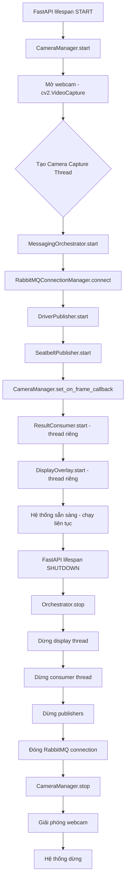
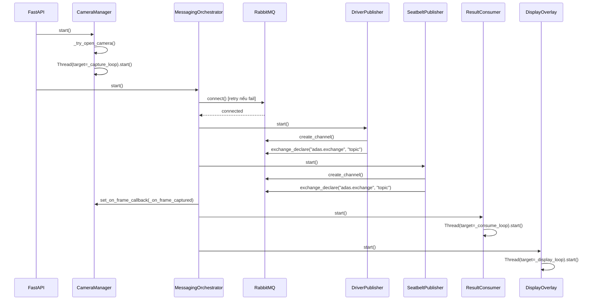
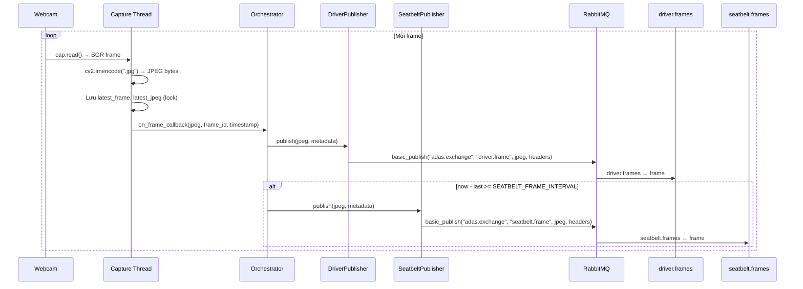
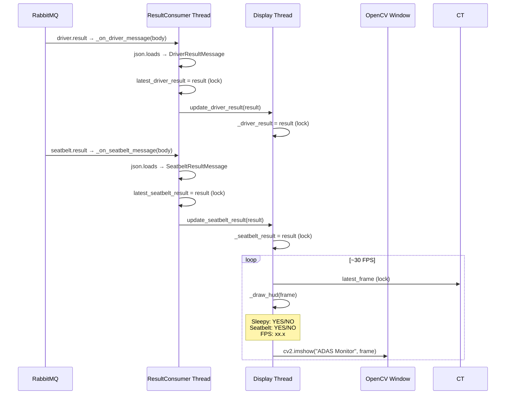
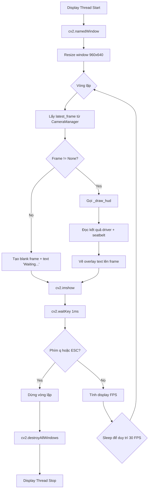
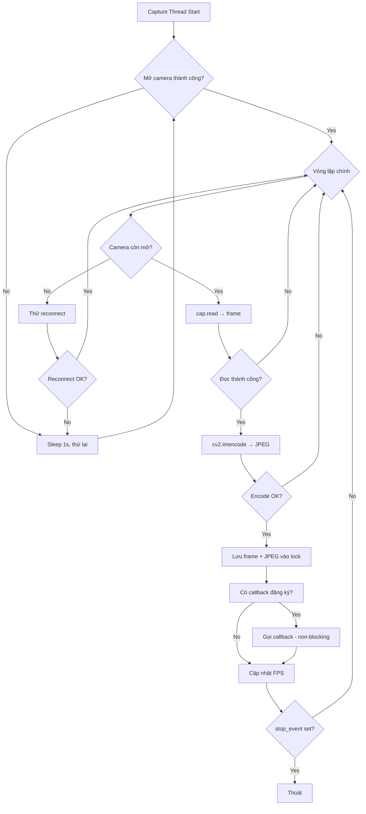
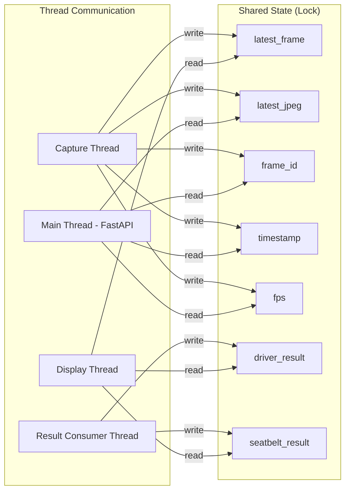

# Logic + AI - Camera-Service

## Lưu ý quan trọng

**Camera-Service KHÔNG thực hiện bất kỳ suy luận AI nào.** Tất cả AI logic nằm ở Driver-Service (MediaPipe EAR) và Seatbelt-Service (YOLO). Camera-Service chỉ thu nhận, mã hóa, phân phối khung hình và hiển thị kết quả.

Tài liệu này mô tả luồng xử lý hệ thống (system logic), không mô tả toán học AI.

---

## Runtime Flow - Toàn bộ vòng đời



---

## Sequence Diagram - Khởi động hệ thống



---

## Sequence Diagram - Capture và Publish Frame



---

## Sequence Diagram - Nhận và hiển thị kết quả AI



---

## Luồng hiển thị - Display Loop



---

## Luồng Camera Capture - Chi tiết



---

## Overlay HUD - Chi tiết hiển thị

```
┌────────────────────────────────────────────────┐
│ ████████████████████████                        │
│ █ Sleepy : NO        █  ← dòng 1 (y=30)        │
│ ████████████████████████                        │
│ ████████████████████████                        │
│ █ Seatbelt : YES     █  ← dòng 2 (y=60)        │
│ ████████████████████████                        │
│ ████████████████████████                        │
│ █ FPS : 29.5         █  ← dòng 3 (y=90)        │
│ ████████████████████████                        │
│                                                 │
│                                                 │
│              [Luồng camera]                     │
│                                                 │
│                                                 │
└────────────────────────────────────────────────┘
```

**Chi tiết overlay:**

- Nền đen (`0,0,0`), chữ trắng (`255,255,255`).
- Font: `cv2.FONT_HERSHEY_SIMPLEX`, scale 0.6, thickness 2.
- Mỗi dòng cách nhau 30px theo chiều dọc.
- Dữ liệu lấy từ `ResultConsumer` latest result (thread-safe lock).

---

## Tương tác giữa các thread



---

## Ghi chú

- Camera-Service **không có sliding window** - đây là logic của Driver-Service.
- Camera-Service **không có object detection** - đây là logic của Seatbelt-Service.
- Camera-Service **không tính EAR** - đây là logic của Driver-Service.
- Mọi giá trị hiển thị trên overlay đến từ kết quả được publish bởi các dịch vụ AI.
