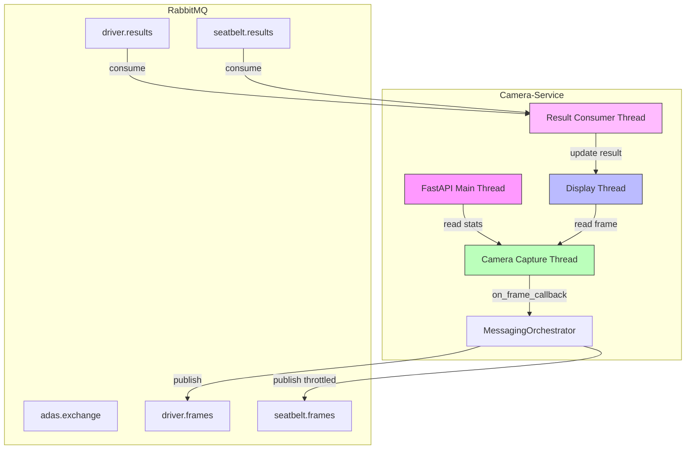
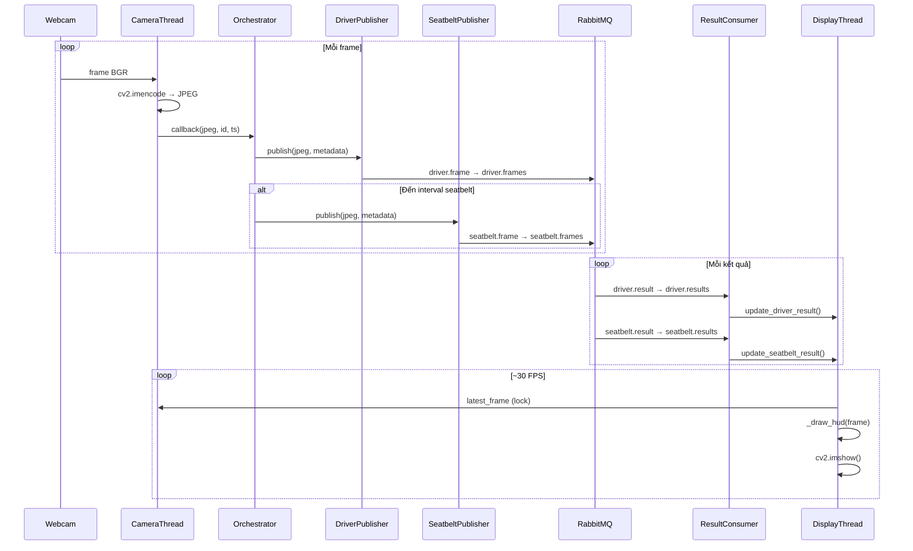

# Giải pháp kỹ thuật - Camera-Service

## Kiến trúc tổng thể

Camera-Service được thiết kế theo kiến trúc **đa luồng (multi-threaded)** với **giao tiếp bất đồng bộ qua RabbitMQ**. Mỗi thành phần chạy trong một thread riêng biệt, giao tiếp thông qua các cơ chế thread-safe (Lock, Event).

### Sơ đồ thành phần



---

## RabbitMQ

### Vì sao chọn RabbitMQ thay vì HTTP đồng bộ?

| Tiêu chí | HTTP đồng bộ (cũ) | RabbitMQ (mới) |
|----------|-------------------|-----------------|
| **Phụ thuộc tốc độ AI** | Camera FPS giảm nếu AI chậm | Camera FPS độc lập hoàn toàn |
| **Mô hình giao tiếp** | 1-1 đồng bộ (request-response) | N-N bất đồng bộ (publish-subscribe) |
| **Khả năng mở rộng** | Khó, cần load balancer | Dễ, thêm consumer vào queue |
| **Khả năng phục hồi** | Thất bại ngay nếu service đích chết | Message lưu trong queue, xử lý sau |
| **Băng thông** | HTTP headers lớn | Body nhị phân + headers tối thiểu |
| **Độ trễ** | Round-trip HTTP | Gần như real-time |
| **Back-pressure** | Không có | Queue tự nhiên giới hạn tốc độ consumer |

### Thiết kế Exchange và Queue

```
Exchange: adas.exchange (type: topic, durable: true)

Routing:                    Queues:
driver.frame    ──────────▶ driver.frames
seatbelt.frame  ──────────▶ seatbelt.frames
driver.result   ──────────▶ driver.results
seatbelt.result ──────────▶ seatbelt.results
```

---

## Producer

### FramePublisher

`FramePublisher` là lớp chịu trách nhiệm phát hành khung hình JPEG lên RabbitMQ.

**Đặc điểm thiết kế:**

| Thuộc tính | Giá trị |
|------------|---------|
| Exchange | `adas.exchange` |
| Exchange type | `topic` |
| Delivery mode | 2 (persistent) |
| Content type | `image/jpeg` |
| Body format | Raw JPEG bytes |
| Header format | `frame_id` (int), `timestamp` (string) |
| Thread safety | Lock cho mỗi lần `basic_publish` |
| Retry | 1 lần retry với channel mới nếu channel đóng |

**Vì sao dùng raw JPEG bytes thay vì Base64?**

- Base64 tăng kích thước ~33%.
- JPEG đã là định dạng nhị phân, truyền trực tiếp hiệu quả hơn.
- AMQP hỗ trợ binary body tự nhiên.

**Vì sao dùng headers cho metadata thay vì JSON body?**

- Giữ body là raw JPEG, không cần wrapper format.
- Headers được RabbitMQ index, có thể dùng để routing/filtering.
- Không cần parse toàn bộ message để đọc metadata.

---

## Consumer

### ResultConsumer

`ResultConsumer` là lớp tiêu thụ kết quả AI từ RabbitMQ.

**Đặc điểm thiết kế:**

| Thuộc tính | Giá trị |
|------------|---------|
| Số queue | 2 (`driver.results`, `seatbelt.results`) |
| Auto ack | True (không cần xác nhận thủ công) |
| Thread model | 1 thread, blocking `start_consuming()` |
| Callback pattern | Đăng ký callback qua `on_driver_result()` và `on_seatbelt_result()` |
| Parse JSON | Pydantic model validation |
| Lưu trữ | `latest_driver_result`, `latest_seatbelt_result` (thread-safe) |
| Reconnect | Tự động reconnect với delay 2s |

**Vì sao dùng auto_ack=True?**

- Kết quả AI không critical - nếu mất một vài kết quả, overlay chỉ hiển thị kết quả cũ.
- Đơn giản hóa code consumer.
- Tránh tắc nghẽn nếu consumer không kịp ack.

---

## Threading

Camera-Service sử dụng **4 thread chính**, mỗi thread có trách nhiệm riêng:

| Thread | Tên | Trách nhiệm | Cơ chế dừng |
|--------|-----|-------------|-------------|
| Main | `MainThread` | FastAPI HTTP server | Uvicorn shutdown |
| Camera | `camera-capture` | Đọc webcam + encode JPEG | `threading.Event` |
| Consumer | `result-consumer` | Lắng nghe RabbitMQ kết quả | `threading.Event` |
| Display | `display` | cv2.imshow + HUD overlay | `threading.Event` |

**Nguyên tắc threading:**

1. Mỗi thread có `stop_event` riêng để báo hiệu dừng.
2. Dữ liệu dùng chung được bảo vệ bằng `threading.Lock`.
3. Không thread nào block thread khác.
4. Camera thread là daemon - tự động kết thúc khi MainThread kết thúc.

### Thread communication

```
Camera Thread          → on_frame_callback() → MessagingOrchestrator
MessagingOrchestrator  → FramePublisher      → RabbitMQ
RabbitMQ               → ResultConsumer      → update_driver/seatbelt_result()
ResultConsumer         → Display.update_*()  → Display Thread
Display Thread         → camera.latest_frame → CameraManager (lock)
```

---

## Message Flow



---

## Docker

Camera-Service được đóng gói trong Docker container với các đặc điểm:

- **Base image**: `python:3.11-slim`
- **System dependencies**: `libgl1`, `libglib2.0-0`, `libsm6`, `libxext6`, `libxrender-dev` (cho OpenCV)
- **Network**: `adas-net` bridge network
- **Port**: 8005 (internal + exposed)
- **Khởi động**: `python -m uvicorn app.main:app --host 0.0.0.0 --port 8005`

**Lưu ý về webcam trong Docker:**

Trên Windows, Docker không thể truy cập webcam trực tiếp. Camera-Service nên được chạy natively trên máy host Windows, chỉ sử dụng Docker cho các service khác.

---

## Environment Variables

Tất cả cấu hình được quản lý qua biến môi trường, cho phép thay đổi mà không cần build lại code.

### Camera Configuration

| Biến | Mặc định | Mô tả |
|------|----------|-------|
| `CAMERA_INDEX` | `0` | Chỉ số webcam |
| `JPEG_QUALITY` | `85` | Chất lượng nén JPEG (0-100) |
| `FRAME_WIDTH` | `640` | Độ rộng frame mục tiêu |
| `FRAME_HEIGHT` | `480` | Độ cao frame mục tiêu |
| `DEFAULT_FPS` | `30` | FPS mặc định (dùng cho hiển thị) |

### RabbitMQ Configuration

| Biến | Mặc định | Mô tả |
|------|----------|-------|
| `RABBITMQ_HOST` | `localhost` | RabbitMQ hostname |
| `RABBITMQ_PORT` | `5672` | RabbitMQ port |
| `RABBITMQ_VHOST` | `/` | Virtual host |
| `RABBITMQ_USER` | `guest` | Username |
| `RABBITMQ_PASS` | `guest` | Password |

### Seatbelt Throttle

| Biến | Mặc định | Mô tả |
|------|----------|-------|
| `SEATBELT_FRAME_INTERVAL` | `600.0` | Khoảng thời gian giữa các lần gửi frame cho Seatbelt (giây) |

### Service Configuration

| Biến | Mặc định | Mô tả |
|------|----------|-------|
| `PORT` | `8005` | HTTP port |
| `LOG_LEVEL` | `INFO` | Mức log (DEBUG, INFO, WARNING, ERROR) |
| `SERVICE_NAME` | `camera-service` | Tên service trong log |

---

## Scalability

### Khả năng mở rộng hiện tại

1. **Thêm dịch vụ AI mới**: Chỉ cần tạo thêm `FramePublisher` với routing key mới trong `MessagingOrchestrator.__init__()`.
2. **Nhiều consumer cho cùng queue**: RabbitMQ topic exchange hỗ trợ multiple consumers với round-robin dispatching.
3. **Tách biệt hoàn toàn**: Mỗi service có queue riêng, không ảnh hưởng lẫn nhau.

### Hạn chế hiện tại

1. **Một webcam**: Camera-Service hiện chỉ hỗ trợ một webcam.
2. **Single instance**: Mỗi camera chỉ có một instance Camera-Service.
3. **Không có message TTL**: Frame cũ trong queue không tự expire.

### Hướng mở rộng trong tương lai

1. Hỗ trợ nhiều camera (multi-camera capture).
2. Message TTL để tự động bỏ frame cũ.
3. Dead Letter Queue cho message không xử lý được.
4. Cluster RabbitMQ cho high availability.
