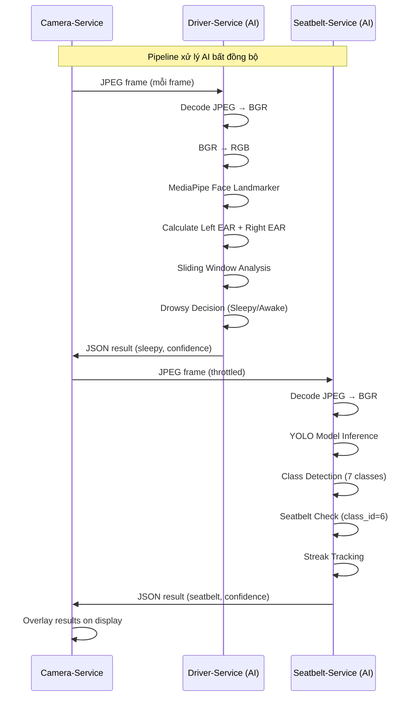

# AI Pipeline - Camera-Service

## Lưu ý quan trọng

**Camera-Service KHÔNG chứa bất kỳ logic suy luận AI nào.** Tài liệu này mô tả vị trí của Camera-Service trong pipeline AI tổng thể và cách dữ liệu luân chuyển giữa các thành phần AI.

## Vị trí trong AI Pipeline

```
┌─────────────┐
│  Webcam     │
│  (Hardware) │
└──────┬──────┘
       │ BGR frames
       ▼
┌──────────────────────────────────────────────┐
│              CAMERA-SERVICE                  │
│                                              │
│  Capture → Encode JPEG → Publish to RabbitMQ │
│                                              │
│  (KHÔNG chạy AI - chỉ thu nhận & phân phối) │
└──────────────────┬───────────────────────────┘
                   │
         ┌─────────┴─────────┐
         ▼                   ▼
┌─────────────────┐  ┌─────────────────┐
│ DRIVER-SERVICE  │  │ SEATBELT-SERVICE│
│                 │  │                 │
│ MediaPipe       │  │ YOLO Model      │
│ Face Landmarker │  │ (best_1.pt)     │
│                 │  │                 │
│ EAR Calculation │  │ Object Detection│
│ Sliding Window  │  │ Streak Tracking │
│ Drowsy Decision │  │ Warning Logic   │
└────────┬────────┘  └────────┬────────┘
         │                    │
         ▼                    ▼
┌──────────────────────────────────────────────┐
│              CAMERA-SERVICE                  │
│                                              │
│  ResultConsumer ← driver.results             │
│  ResultConsumer ← seatbelt.results           │
│  DisplayOverlay → cv2.imshow                 │
└──────────────────────────────────────────────┘
```

## Luồng dữ liệu AI



## AI Models (không nằm trong Camera-Service)

| Model | Vị trí | Service | Mục đích |
|-------|--------|---------|----------|
| MediaPipe Face Landmarker | `driver-service/face_landmarker.task` | Driver-Service | Phát hiện khuôn mặt và landmark mắt |
| YOLO (best_1.pt) | `seatbelt_service/best_1.pt` | Seatbelt-Service | Phát hiện dây an toàn và 6 lớp khác |

## Camera-Service KHÔNG làm gì

- KHÔNG chạy MediaPipe.
- KHÔNG chạy YOLO.
- KHÔNG tính EAR (Eye Aspect Ratio).
- KHÔNG có sliding window.
- KHÔNG có object detection.
- KHÔNG có bất kỳ model AI nào được load.
- KHÔNG cần GPU.

## Camera-Service CHỈ làm gì

- Thu nhận frame từ webcam.
- Mã hóa JPEG.
- Gửi qua RabbitMQ.
- Nhận kết quả JSON.
- Hiển thị kết quả lên màn hình.
