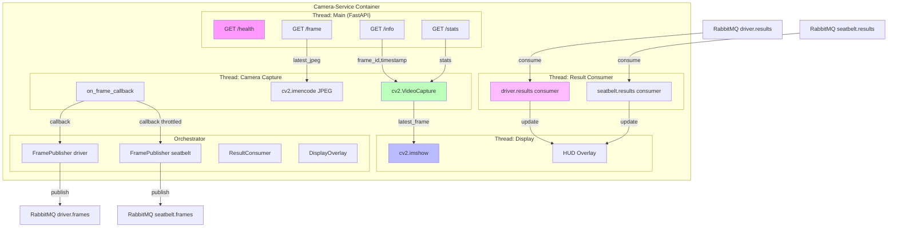

# Kiến trúc - Camera-Service

## Tổng quan

Camera-Service là microservice đầu vào của hệ thống ADAS, chịu trách nhiệm thu nhận hình ảnh và phân phối qua RabbitMQ. Service được thiết kế theo kiến trúc **đa luồng (multi-threaded)** với các thành phần độc lập, giao tiếp qua cơ chế thread-safe.

## Sơ đồ kiến trúc



## Thành phần chính

### 1. FastAPI Application (`app/main.py`)
- Chạy trên MainThread.
- Cung cấp REST API: `/health`, `/frame`, `/info`, `/stats`.
- Quản lý vòng đời (lifespan): khởi động CameraManager và MessagingOrchestrator khi start, dừng khi shutdown.

### 2. CameraManager (`services/camera_manager.py`)
- Chạy trong thread `camera-capture`.
- Mở webcam qua OpenCV.
- Vòng lặp đọc frame → mã hóa JPEG → gọi callback.
- Tự động reconnect khi mất webcam.
- Lưu trữ latest frame và JPEG trong bộ nhớ (thread-safe).

### 3. MessagingOrchestrator (`messaging/orchestrator.py`)
- Điều phối toàn bộ giao tiếp RabbitMQ.
- Wire các thành phần lại với nhau.
- Quản lý start/stop theo thứ tự.

### 4. FramePublisher (`messaging/publisher.py`)
- Publish JPEG frames lên RabbitMQ exchange.
- Hai instance: `driver.frame` và `seatbelt.frame`.
- Tự động reconnect channel khi đóng.

### 5. ResultConsumer (`messaging/consumer.py`)
- Chạy trong thread `result-consumer`.
- Lắng nghe 2 queue: `driver.results`, `seatbelt.results`.
- Parse JSON, lưu kết quả mới nhất.
- Gọi callback để cập nhật DisplayOverlay.

### 6. DisplayOverlay (`services/display.py`)
- Chạy trong thread `display`.
- Hiển thị frame + HUD overlay qua OpenCV.
- FPS hiển thị cố định ~30 FPS.
- Hỗ trợ phím tắt: `q`/`ESC` để thoát.

### 7. RabbitMQConnectionManager (`messaging/connection.py`)
- Quản lý một kết nối đến RabbitMQ.
- Tạo channel cho publisher/consumer.
- Auto-reconnect với exponential backoff.

## Luồng dữ liệu

```
Webcam → [Capture Thread] → JPEG bytes
                                │
                    ┌───────────┴───────────┐
                    ▼                       ▼
            driver.frames           seatbelt.frames
            (mỗi frame)             (throttled)
                    │                       │
                    ▼                       ▼
            Driver-Service           Seatbelt-Service
                    │                       │
                    ▼                       ▼
            driver.results           seatbelt.results
                    │                       │
                    └───────────┬───────────┘
                                ▼
                    [Result Consumer Thread]
                                │
                                ▼
                    [Display Thread] → cv2.imshow
```

## Thread Model

| Thread | Loại | Ưu tiên | Cơ chế dừng |
|--------|------|---------|-------------|
| MainThread | Non-daemon | Normal | FastAPI shutdown |
| camera-capture | Daemon | Normal | threading.Event |
| result-consumer | Daemon | Normal | threading.Event |
| display | Daemon | Normal | threading.Event |

## Dependency Injection

Camera-Service sử dụng Singleton pattern thay vì DI container:

- `camera_manager` - singleton trong `camera_manager_instance.py`
- `get_orchestrator()` - singleton trong `orchestrator.py`
- `get_settings()` - cached singleton trong `config.py`
- `get_logger()` - singleton trong `logger.py`

## Giao tiếp giữa các thành phần

| Từ | Đến | Cơ chế | Dữ liệu |
|----|-----|--------|---------|
| CameraManager | Orchestrator | Callback function | JPEG bytes, frame_id, timestamp |
| Orchestrator | FramePublisher | Direct method call | JPEG bytes, FrameMessage |
| FramePublisher | RabbitMQ | AMQP basic_publish | JPEG bytes + headers |
| RabbitMQ | ResultConsumer | AMQP basic_consume | JSON body |
| ResultConsumer | DisplayOverlay | Callback function | DriverResultMessage, SeatbeltResultMessage |
| CameraManager | DisplayOverlay | Property read (lock) | numpy array (BGR frame) |
| CameraManager | FastAPI routes | Property read (lock) | JPEG bytes, stats |
