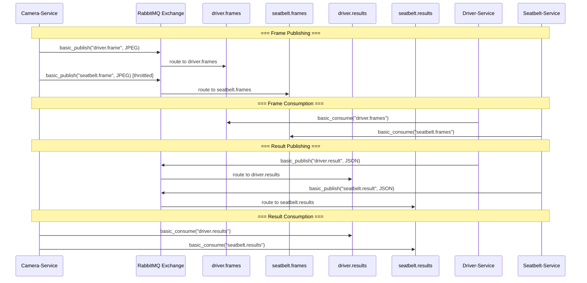

# RabbitMQ Design - Camera-Service

## Tổng quan

Camera-Service sử dụng RabbitMQ làm message broker trung tâm để giao tiếp bất đồng bộ với các dịch vụ AI. Thiết kế dựa trên mô hình **publish-subscribe** với **topic exchange**.

## Exchange

### Tại sao chọn topic exchange?

| Exchange type | Ưu điểm | Nhược điểm | Phù hợp? |
|---------------|---------|------------|----------|
| Direct | Đơn giản, nhanh | Cứng nhắc, không pattern matching | Không |
| Fanout | Broadcast đến tất cả queue | Không chọn lọc được queue | Không |
| **Topic** | Pattern matching, linh hoạt | Phức tạp hơn direct | **Có** |
| Headers | Routing theo headers | Chậm, ít dùng | Không |

**Lý do chọn topic**:
- Có thể thêm routing key mới mà không cần thay đổi code cũ.
- Pattern matching cho phép subscribe theo mẫu (vd: `*.frames`, `*.results`).
- Dễ mở rộng khi thêm dịch vụ AI mới.

### Cấu hình Exchange

```
Tên:         adas.exchange
Loại:        topic
Durable:     true (tồn tại sau khi restart RabbitMQ)
Auto-delete: false
Internal:    false
```

## Queue Design

### Frame Queues (Camera là Publisher)

```
driver.frames:
  - durable: true
  - routing_key: driver.frame
  - consumer: Driver-Service
  - tần suất: mỗi frame

seatbelt.frames:
  - durable: true
  - routing_key: seatbelt.frame
  - consumer: Seatbelt-Service
  - tần suất: mỗi SEATBELT_FRAME_INTERVAL giây
```

### Result Queues (Camera là Consumer)

```
driver.results:
  - durable: true
  - routing_key: driver.result
  - publisher: Driver-Service
  - tần suất: mỗi frame được xử lý

seatbelt.results:
  - durable: true
  - routing_key: seatbelt.result
  - publisher: Seatbelt-Service
  - tần suất: mỗi frame được xử lý
```

## Routing Keys

| Routing Key | Publisher | Consumer(s) | Mô tả |
|-------------|-----------|-------------|-------|
| `driver.frame` | Camera-Service | Driver-Service | Frame cho phát hiện buồn ngủ |
| `seatbelt.frame` | Camera-Service | Seatbelt-Service | Frame cho phát hiện dây an toàn |
| `driver.result` | Driver-Service | Camera-Service | Kết quả phân tích buồn ngủ |
| `seatbelt.result` | Seatbelt-Service | Camera-Service | Kết quả phân tích dây an toàn |

## Message Flow



## Connection Management

### Số lượng Connection

Camera-Service tạo **1 connection** đến RabbitMQ, chia sẻ cho tất cả publishers và consumers.

### Số lượng Channel

Mỗi publisher/consumer tạo channel riêng từ connection:
- 2 channels cho FramePublishers (driver, seatbelt)
- 1 channel cho ResultConsumer

### Heartbeat

- `heartbeat=60` - Gửi heartbeat mỗi 60 giây để giữ connection alive.
- Nếu RabbitMQ không nhận được heartbeat trong 2 chu kỳ → đóng connection.
- Client phát hiện connection đóng và tự động reconnect.

## Reconnect Strategy

```
Lần 1: chờ 1s  → thử lại
Lần 2: chờ 2s  → thử lại
Lần 3: chờ 4s  → thử lại
Lần 4: chờ 8s  → thử lại
Lần 5: chờ 16s → thử lại
Lần 6+: chờ 30s → thử lại (cap)

Lặp vô hạn cho đến khi:
- Kết nối thành công
- Hoặc stop_event được set (shutdown)
```

## Message Properties

### Frame Message

| Property | Value | Mục đích |
|----------|-------|----------|
| `delivery_mode` | 2 | Persistent - ghi vào disk |
| `content_type` | `image/jpeg` | Cho consumer biết định dạng body |
| `headers.frame_id` | string(int) | ID frame để tracking |
| `headers.timestamp` | string(float) | Thời điểm capture |

### Result Message

| Property | Value | Mục đích |
|----------|-------|----------|
| `delivery_mode` | 2 | Persistent |
| `content_type` | `application/json` | Body là JSON |

## Prefetch & QoS

- **Camera Publisher**: Không áp dụng (chỉ publish).
- **Camera Consumer**: `auto_ack=True` → không cần prefetch.

## Dead Letter Queue

> Chưa được triển khai trong phiên bản hiện tại.

Trong tương lai có thể thêm:
- `x-dead-letter-exchange` cho message bị reject.
- `x-message-ttl` để tự động expire frame cũ.

## Monitoring

RabbitMQ Management UI: `http://localhost:15672` (guest/guest)

Các metric quan trọng:
- **Queue depth**: Số message trong `driver.frames` và `seatbelt.frames`.
- **Message rate**: Publish/consume rate.
- **Connection count**: Số connection đang mở.
- **Channel count**: Số channel đang mở.
