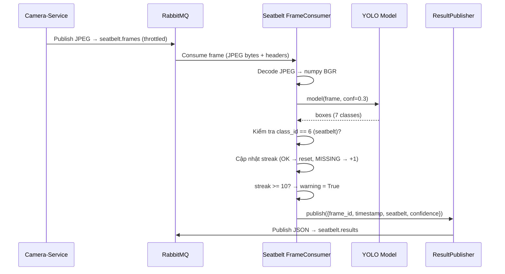

# README - Seatbelt-Service

## Giới thiệu

Seatbelt-Service là dịch vụ phát hiện dây an toàn sử dụng mô hình YOLO (You Only Look Once). Dịch vụ nhận khung hình từ Camera-Service qua RabbitMQ, chạy suy luận YOLO để phát hiện trạng thái thắt dây an toàn của tài xế, và phát hành kết quả về lại RabbitMQ.

Phiên bản hiện tại sử dụng giao tiếp bất đồng bộ qua RabbitMQ. Toàn bộ logic suy luận YOLO được giữ nguyên từ phiên bản HTTP, chỉ thay đổi lớp giao tiếp.

## Mục đích Service

| Mục đích | Mô tả |
|----------|-------|
| Nhận khung hình | Tiêu thụ JPEG frames từ queue `seatbelt.frames` qua RabbitMQ |
| Phát hiện dây an toàn | Chạy YOLO inference để phát hiện 7 lớp đối tượng, trong đó có `seatbelt` |
| Theo dõi streak | Đếm số frame liên tiếp không có seatbelt để đưa ra cảnh báo |
| Phát hành kết quả | Gửi kết quả JSON lên queue `seatbelt.results` |
| Cung cấp API | REST API cho health check, trạng thái phát hiện, và thống kê |

## Chức năng

1. **Nhận khung hình từ RabbitMQ** - Consume JPEG frames từ queue `seatbelt.frames`
2. **Giải mã JPEG** - Chuyển JPEG bytes thành numpy array BGR
3. **Chạy YOLO inference** - Sử dụng model `best_1.pt` (7 classes)
4. **Phân tích kết quả** - Kiểm tra class_id=6 (seatbelt) có xuất hiện không
5. **Theo dõi streak** - Đếm frame liên tiếp không có seatbelt
6. **Cảnh báo** - Warning khi streak vượt ngưỡng `WARNING_FRAMES`
7. **Phát hành kết quả** - JSON result → queue `seatbelt.results`
8. **API REST** - `/health`, `/check`, `/stats`

## Kiến trúc

```
Seatbelt-Service
├── FastAPI Main Thread         (HTTP request/response)
├── Frame Consumer Thread       (nhận JPEG từ RabbitMQ → YOLO → publish kết quả)
└── YOLO Model                  (ultralytics YOLO - GIỮ NGUYÊN từ phiên bản cũ)
```

## Luồng hoạt động



## Công nghệ sử dụng

| Công nghệ | Phiên bản | Mục đích |
|-----------|-----------|----------|
| Python | 3.11 | Ngôn ngữ chính |
| FastAPI | 0.111.0 | REST API framework |
| Uvicorn | 0.30.1 | ASGI server |
| Ultralytics | 8.3.67 | YOLO model framework |
| OpenCV | 4.13.0.92 | Giải mã JPEG |
| Pika | 1.3.2 | RabbitMQ client |
| Pydantic | 2.7.1 | Data validation |
| NumPy | 2.4.6 | Xử lý mảng ảnh |

## Cấu trúc thư mục

```
seatbelt_service/
├── Dockerfile
├── main.py                          # Entry point: uvicorn runner
├── main_detection.py                # Standalone test script (giữ nguyên)
├── requirements.txt
├── best_1.pt                        # YOLO model weights
│
├── app/
│   ├── __init__.py
│   ├── main.py                      # FastAPI app + lifespan
│   ├── api/
│   │   └── seatbelt.py              # Routes: /health, /check, /stats
│   ├── core/
│   │   └── config.py                # Settings (YOLO + RabbitMQ)
│   ├── messaging/
│   │   ├── connection.py            # RabbitMQConnectionManager
│   │   ├── publisher.py             # ResultPublisher
│   │   ├── consumer.py              # FrameConsumer
│   │   └── orchestrator.py          # MessagingOrchestrator
│   ├── services/
│   │   ├── seatbelt_detector.py     # SeatbeltDetector (YOLO)
│   │   └── detector_instance.py     # Singleton
│   ├── schemas/
│   │   └── seatbelt.py              # API schemas
│   └── utils/
│       └── logger.py                # Structured logger
│
├── documents/
├── memory/
├── knowledge-base/
└── tests/
```

## Runtime Flow

```
1. FastAPI lifespan START
2. MessagingOrchestrator.start()
   a. SeatbeltDetector.load_model() → tải YOLO best_1.pt
   b. RabbitMQConnectionManager.connect()
   c. ResultPublisher.start() → tạo channel, khai báo exchange
   d. FrameConsumer.start() → thread riêng consume seatbelt.frames
3. FrameConsumer nhận frame → SeatbeltDetector.process() → YOLO → publish kết quả
4. FastAPI lifespan SHUTDOWN
5. MessagingOrchestrator.stop()
   → dừng consumer → dừng publisher → đóng connection
```

## Memory

Thư mục `memory/` lưu trữ ký ức dài hạn của dự án.

- **decisions.md** - Các quyết định thiết kế
- **changelog.md** - Lịch sử thay đổi
- **implementation_notes.md** - Ghi chú cho developer
- **known_issues.md** - Lỗi đã biết
- **lessons_learned.md** - Bài học kinh nghiệm
- **development_log.md** - Nhật ký phát triển

## Knowledge Base

Thư mục `knowledge-base/` chứa kiến thức ổn định.

- **architecture.md** - Kiến trúc
- **api.md** - REST API + RabbitMQ
- **rabbitmq.md** - Thiết kế RabbitMQ
- **project_structure.md** - Cấu trúc thư mục
- **coding_guidelines.md** - Quy ước code
- **ai_pipeline.md** - Luồng AI
- **deployment.md** - Triển khai
- **configuration.md** - Cấu hình
- **glossary.md** - Thuật ngữ
- **troubleshooting.md** - Xử lý sự cố

## Danh sách tài liệu

| Tài liệu | Đường dẫn |
|----------|-----------|
| README | `README.md` |
| Yêu cầu | `documents/requirement.md` |
| Tính năng | `documents/features.md` |
| Giải pháp kỹ thuật | `documents/tech_solution.md` |
| Logic + AI | `documents/logic_ai.md` |
| Triển khai | `documents/implementation.md` |
| Kiểm thử | `documents/testing.md` |
