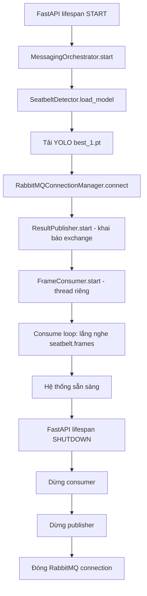
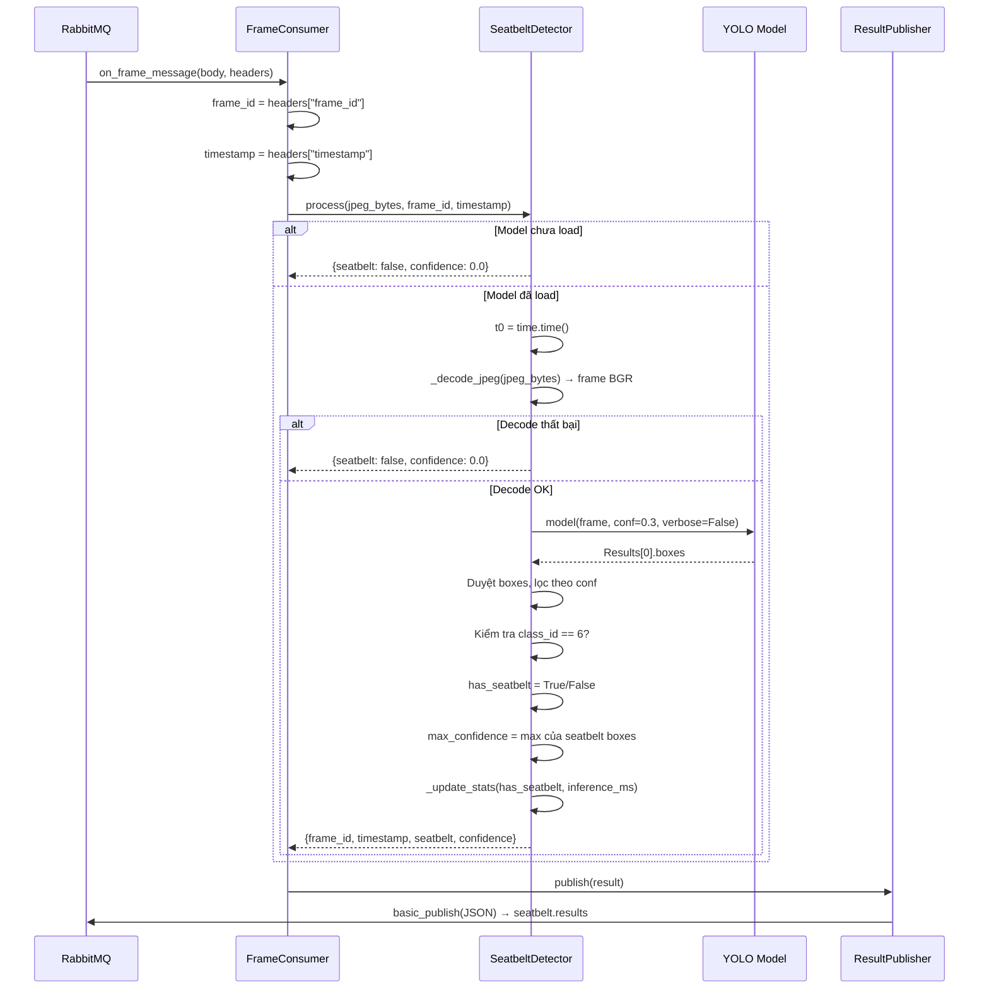

# Logic + AI - Seatbelt-Service

## Lưu ý

**KHÔNG giải thích toán học YOLO.** Tài liệu này chỉ mô tả luồng xử lý hệ thống. Model YOLO được giữ nguyên từ phiên bản trước.

---

## Runtime Flow - Toàn bộ vòng đời



---

## Sequence Diagram - Xử lý một frame



---

## Flowchart - SeatbeltDetector.process()

```mermaid
flowchart TD
    A[Nhận jpeg_bytes, frame_id, timestamp] --> B{Model loaded?}
    B -->|No| C[_build_result: seatbelt=false, confidence=0]
    B -->|Yes| D[_decode_jpeg]
    D --> E{Decode OK?}
    E -->|No| C
    E -->|Yes| F[_run_inference: YOLO model(frame)]
    F --> G[Duyệt qua boxes data]
    G --> H{Lọc conf >= threshold?}
    H -->|Yes| I[Thêm vào detections list]
    I --> J{class_id == 6?}
    J -->|Yes| K[has_seatbelt = True<br/>Cập nhật max_confidence]
    J -->|No| L[Tiếp tục duyệt]
    K --> L
    L --> H
    H -->|Hết boxes| M[_update_stats: cập nhật streak]
    M --> N{has_seatbelt?}
    N -->|Yes| O[streak = 0<br/>seatbelt_ok += 1]
    N -->|No| P[streak += 1<br/>seatbelt_missing += 1]
    O --> Q[_build_result]
    P --> Q
    Q --> R[Return dict: frame_id, timestamp, seatbelt, confidence]

    style F fill:#f96,stroke:#333
    style K fill:#9f6,stroke:#333
    style R fill:#69f,stroke:#333
```

---

## Các class YOLO

| Class ID | Tên | Mô tả |
|----------|-----|-------|
| 0 | cell phone | Sử dụng điện thoại khi lái xe |
| 1 | drinking | Uống nước khi lái xe |
| 2 | eyeglass | Đeo kính |
| 3 | hands off | Tay rời vô lăng |
| 4 | hands on | Tay trên vô lăng |
| 5 | mask | Đeo khẩu trang |
| 6 | seatbelt | Dây an toàn |

---

## Streak Tracking Logic

```
Mỗi frame sau khi YOLO inference:

if has_seatbelt == True:
    _no_seatbelt_streak = 0          ← reset
    _seatbelt_ok += 1
else:
    _no_seatbelt_streak += 1         ← tăng
    _seatbelt_missing += 1

warning = _no_seatbelt_streak >= WARNING_FRAMES
```

**Ví dụ với WARNING_FRAMES=10:**

```
Frame 1: has_seatbelt=True  → streak=0,  warning=False
Frame 2: has_seatbelt=False → streak=1,  warning=False
Frame 3: has_seatbelt=False → streak=2,  warning=False
...
Frame 11: has_seatbelt=False → streak=10, warning=True  ← CẢNH BÁO
Frame 12: has_seatbelt=True  → streak=0,  warning=False ← Reset
```

---

## Ghi chú

- **Seatbelt-Service không có sliding window** như Driver-Service. Streak tracking đơn giản hơn: chỉ đếm frame liên tiếp.
- **Seatbelt-Service không vẽ bounding box** lên ảnh. Chỉ trả về kết quả JSON.
- **Confidence calculation**: Lấy max confidence của tất cả boxes có class_id=6.
