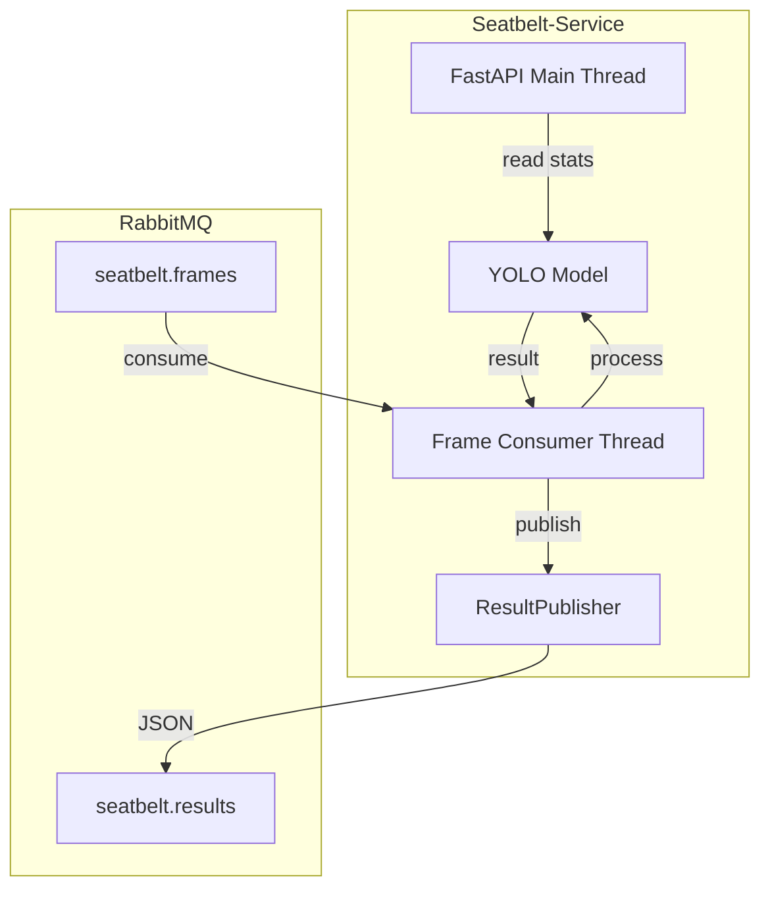
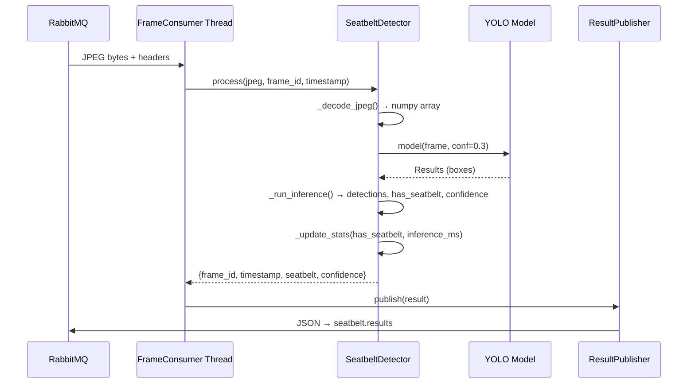

# Giải pháp kỹ thuật - Seatbelt-Service

## Kiến trúc

Seatbelt-Service được thiết kế với 2 thread chính:



## Vì sao chọn RabbitMQ thay vì HTTP?

| Tiêu chí | HTTP (cũ) | RabbitMQ (mới) |
|----------|-----------|-----------------|
| Nhận frame | `httpx.get(camera/frame)` mỗi 3 giây | `basic_consume(seatbelt.frames)` - event-driven |
| Độ trễ | HTTP round-trip + 3s polling interval | Gần như real-time |
| Kết quả | Chỉ qua API `/check` | Publish JSON lên queue - nhiều consumer |
| Khả năng mở rộng | 1-1 với Camera | N consumer trên 1 queue (round-robin) |

## Producer

### ResultPublisher

Phát hành kết quả phát hiện seatbelt dưới dạng JSON.

| Thuộc tính | Giá trị |
|------------|---------|
| Exchange | `adas.exchange` |
| Routing key | `seatbelt.result` |
| Body format | JSON |
| Content type | `application/json` |
| Delivery mode | 2 (persistent) |

## Consumer

### FrameConsumer

Tiêu thụ JPEG frames từ queue `seatbelt.frames`.

| Thuộc tính | Giá trị |
|------------|---------|
| Queue | `seatbelt.frames` |
| Routing key | `seatbelt.frame` |
| Prefetch count | 1 (xử lý tuần tự từng frame) |
| Auto ack | True |

## Exchange và Queue

```
Exchange: adas.exchange (topic, durable)

Binding:
  seatbelt.frame  → seatbelt.frames  (nhận frame từ Camera)
  seatbelt.result → seatbelt.results (gửi kết quả cho Camera)
```

## Threading

| Thread | Trách nhiệm |
|--------|-------------|
| MainThread | FastAPI HTTP server |
| frame-consumer | Nhận frame → YOLO → publish kết quả |

## Message Flow



## Docker

Seatbelt-Service chạy trong Docker container trên network `adas-net`.

```yaml
seatbelt-service:
  build:
    context: ./services/seatbelt_service
  ports:
    - "8007:8007"
  environment:
    RABBITMQ_HOST: rabbitmq
    MODEL_PATH: best.pt
  depends_on:
    rabbitmq:
      condition: service_healthy
```

## Environment Variables

| Biến | Mặc định    | Mô tả |
|------|-------------|-------|
| `MODEL_PATH` | `best.pt`   | Đường dẫn file YOLO model |
| `CONFIDENCE_THRESHOLD` | `0.3`       | Ngưỡng confidence |
| `WARNING_FRAMES` | `10`        | Số frame liên tiếp để kích hoạt warning |
| `RABBITMQ_HOST` | `localhost` | RabbitMQ host |
| `RABBITMQ_PORT` | `5672`      | RabbitMQ port |
| `RABBITMQ_USER` | `guest`     | Username |
| `RABBITMQ_PASS` | `guest`     | Password |
| `PORT` | `8007`      | HTTP port |

## Khả năng mở rộng

- **Nhiều consumer**: Chạy nhiều instance Seatbelt-Service, RabbitMQ tự động round-robin.
- **Model khác**: Thay `MODEL_PATH` để dùng model YOLO khác.
- **Thêm class**: Model đã hỗ trợ 7 classes, không cần thay đổi code để phát hiện thêm.
