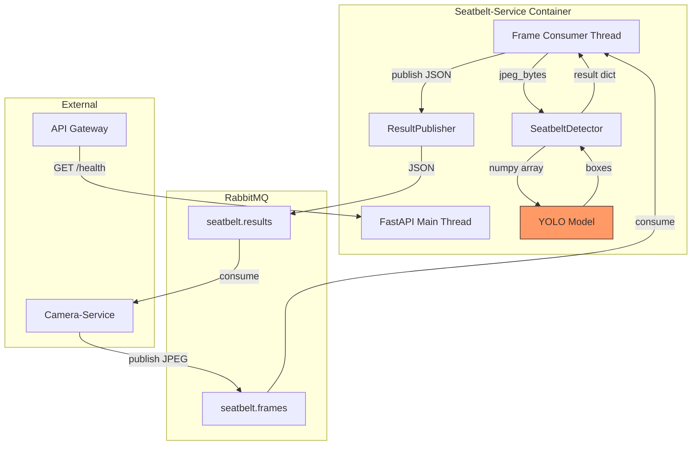

# Kiến trúc - Seatbelt-Service

## Tổng quan

Seatbelt-Service là microservice AI sử dụng YOLO để phát hiện dây an toàn. Service có kiến trúc 2 thread: MainThread (FastAPI) và FrameConsumer (RabbitMQ + YOLO).

## Sơ đồ kiến trúc



## Thành phần

### 1. FastAPI Application (`app/main.py`)
- Chạy trên MainThread.
- REST API: `/health`, `/check`, `/stats`.
- Lifespan: khởi động orchestrator (load YOLO + connect RabbitMQ).

### 2. MessagingOrchestrator (`messaging/orchestrator.py`)
- Điều phối: load model → connect → start publisher → start consumer.

### 3. SeatbeltDetector (`services/seatbelt_detector.py`)
- Chứa toàn bộ logic YOLO (GIỮ NGUYÊN).
- `process(jpeg_bytes, frame_id, timestamp)` → kết quả dict.

### 4. FrameConsumer (`messaging/consumer.py`)
- Thread riêng lắng nghe `seatbelt.frames`.
- prefetch_count=1, auto_ack=True.

### 5. ResultPublisher (`messaging/publisher.py`)
- Publish JSON kết quả lên `seatbelt.results`.

## Thread Model

| Thread | Trách nhiệm |
|--------|-------------|
| MainThread | FastAPI HTTP |
| frame-consumer | Consume → YOLO → publish |

## Luồng dữ liệu

```
Camera-Service → seatbelt.frames → FrameConsumer → SeatbeltDetector.process()
                                                          │
                                                    YOLO model(frame)
                                                          │
                                                    boxes → has_seatbelt?
                                                          │
                                                    ResultPublisher.publish()
                                                          │
                                                    seatbelt.results → Camera-Service
```
